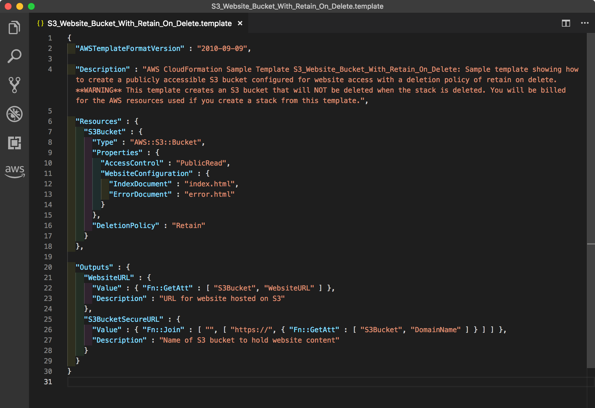

# awesome-vscode-cloudformation-settings

## 📝 VS Code 拡張機能

以下の拡張機能をインストールする．

### YAML サポート

- [YAML - Visual Studio Marketplace](https://marketplace.visualstudio.com/items?itemName=redhat.vscode-yaml)

### YAML インデント

- [Indenticator - Visual Studio Marketplace](https://marketplace.visualstudio.com/items?itemName=SirTori.indenticator)
- [indent-rainbow - Visual Studio Marketplace](https://marketplace.visualstudio.com/items?itemName=oderwat.indent-rainbow)

### AWS CloudFormation サポート

- [vscode-cfn-lint - Visual Studio Marketplace](https://marketplace.visualstudio.com/items?itemName=kddejong.vscode-cfn-lint)
- [CloudFormation - Visual Studio Marketplace](https://marketplace.visualstudio.com/items?itemName=aws-scripting-guy.cform)

## 📝 VS Code 設定

`!Ref` など，組み込み関数をサポートするためにカスタムタグを設定する．

- `Code` → `基本設定` → `設定` → `settings.json` を検索する
- `settings.json で編集` をクリックする
- 以下の YAML を追加する

```json
{
  "yaml.customTags": [
    "!Ref",
    "!Sub scalar",
    "!Sub sequence",
    "!Join sequence",
    "!FindInMap sequence",
    "!GetAtt scalar",
    "!GetAtt sequence",
    "!Base64 mapping",
    "!GetAZs",
    "!Select scalar",
    "!Select sequence",
    "!Split sequence",
    "!ImportValue",
    "!Condition",
    "!Equals sequence",
    "!And",
    "!If",
    "!Not",
    "!Or"
  ]
}
```

## 📝 エディタ例

- [サービス - AWS CloudFormation](https://docs.aws.amazon.com/ja_jp/AWSCloudFormation/latest/UserGuide/sample-templates-services-ap-northeast-1.html)


